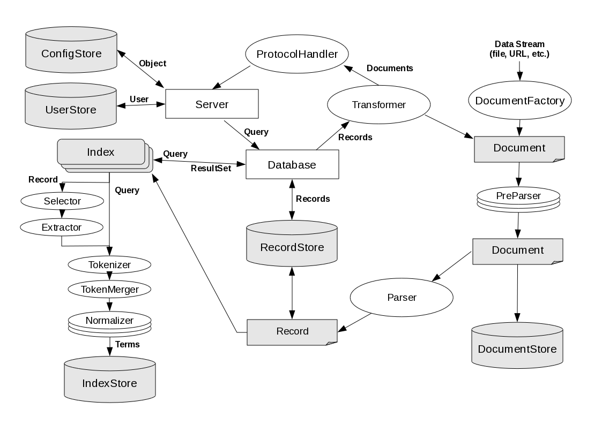

Cheshire3 Object Model
======================

.. toctree::
   :hidden:
   :glob:

   object_*

Overview
--------

Miscellaneous
-------------

Abstract Base Class
~~~~~~~~~~~~~~~~~~~

Abstract Base Class for all configurable objects within the Cheshire3 framework.
It is not the base class for `Data Objects`_ :

* :py:class:`~cheshire3.baseObjects.Document`
* :py:class:`~cheshire3.baseObjects.Record`
* :py:class:`~cheshire3.baseObjects.ResultSet`
* :py:class:`~cheshire3.baseObjects.User`
* Query

See :py:class:`~cheshire3.baseObjects.C3Object` for details and API

Session
~~~~~~~

.. autoclass:: cheshire3.baseObjects.Session

ProtocolMap
~~~~~~~~~~~

.. autoclass:: cheshire3.baseObjects.ProtocolMap

Summary Objects
---------------

Objects that summarize and provide persistent storage for other objects and
their metadata.

:py:class:`~cheshire3.baseObjects.Server`
~~~~~~~~~~~~~~~~~~~~~~~~~~~~~~~~~~~~~~~~~

A :py:class:`~cheshire3.baseObjects.Server` is a collection point for other
objects and an initial entry into the system for requests from a
:py:class:`~cheshire3.baseObjects.ProtocolHandler`.
A :py:class:`~cheshire3.baseObjects.Server` might know about several
:py:class:`~cheshire3.baseObjects.Database`\ s,
:py:class:`~cheshire3.baseObjects.RecordStore` s and so forth, but its main
function is to check whether the request should be accepted or not and create
an environment in which the request can be processed.

It will likely have access to a UserStore database which maintains
authentication and authorization information. The exact nature of this
information is not defined, allowing many possible backend implementations.

:py:class:`~cheshire3.baseObjects.Server`\ s are the top level of configuration
for the system and hence their constructor requires the path to a local XML
configuration file, however from then on configuration information may be
retrieved from other locations such as a remote datastore to enable distributed
environments to maintain synchronicity.

:py:class:`~cheshire3.baseObjects.Database`
~~~~~~~~~~~~~~~~~~~~~~~~~~~~~~~~~~~~~~~~~~~

A :py:class:`~cheshire3.baseObjects.Database` is a collection of
:py:class:`~cheshire3.baseObjects.Record`\ s and
:py:class:`~cheshire3.baseObjects.Index`\ es.

It is responsible for maintaining and allowing access to its components, as
well as metadata associated with the collections. It must be able to interpret
a request, splitting it amongst its known resources and then recombine the
values into a single response.

:py:class:`~cheshire3.baseObjects.DocumentStore`
~~~~~~~~~~~~~~~~~~~~~~~~~~~~~~~~~~~~~~~~~~~~~~~~

A persistent storage mechanism for
:py:class:`~cheshire3.baseObjects.Document` s and their metadata.

:py:class:`~cheshire3.baseObjects.RecordStore`
~~~~~~~~~~~~~~~~~~~~~~~~~~~~~~~~~~~~~~~~~~~~~~

A persistent storage mechanism for :py:class:`~cheshire3.baseObjects.Record` s.

A :py:class:`~cheshire3.baseObjects.RecordStore` allows such operations as
create, update, fetch and delete. It also allows fast retrieval of important
:py:class:`~cheshire3.baseObjects.Record` metadata, for use in computing
relevance rankings for example.

:py:class:`~cheshire3.baseObjects.IndexStore`
~~~~~~~~~~~~~~~~~~~~~~~~~~~~~~~~~~~~~~~~~~~~~

A persistent storage mechanism for terms organized by
:py:class:`~cheshire3.baseObjects.Index`\ es.

Not an ObjectStore, just looks after
:py:class:`~cheshire3.baseObjects.Index`\ es and their terms.

:py:class:`~cheshire3.baseObjects.ResultSetStore`
-------------------------------------------------

A persistent storage mechanism for :py:class:`~cheshire3.baseObjects.ResultSet`
objects.

:py:class:`~cheshire3.baseObjects.ObjectStore`
~~~~~~~~~~~~~~~~~~~~~~~~~~~~~~~~~~~~~~~~~~~~~~

A persistent storage mechanism for configured Cheshire3 objects.

Data Objects
------------

Objects representing data to be stored, indexed, discovered or manipulated.

:py:class:`~cheshire3.baseObjects.Document`
~~~~~~~~~~~~~~~~~~~~~~~~~~~~~~~~~~~~~~~~~~~

A Document is a wrapper for raw data and its metadata.

A Document is the raw data which will become a Record. It may be processed into
a :py:class:`~cheshire3.baseObjects.Record` by a
:py:class:`~cheshire3.baseObjects.Parser`, or into another
:py:class:`~cheshire3.baseObjects.Document` type by a
:py:class:`~cheshire3.baseObjects.PreParser`.
:py:class:`~cheshire3.baseObjects.Document`\ s might be stored in a
:py:class:`~cheshire3.baseObjects.DocumentStore`, if necessary, but can
generally be discarded. :py:class:`~cheshire3.baseObjects.Document`\ s may be
anything from a JPG file, to an unparsed XML file, to a string containing a
URL. This allows for future compatability with new formats, as they may be
incorporated into the system by implementing a
:py:class:`~cheshire3.baseObjects.Document` type and a
:py:class:`~cheshire3.baseObjects.PreParser`.

:py:class:`~cheshire3.baseObjects.Record`
~~~~~~~~~~~~~~~~~~~~~~~~~~~~~~~~~~~~~~~~~

A :py:class:`~cheshire3.baseObjects.Record` is a wrapper for parsed data and
its metadata.

:py:class:`~cheshire3.baseObjects.Record`\ s in the system are commonly stored
in an XML form. Attached to the :py:class:`~cheshire3.baseObjects.Record` is
various configurable metadata, such as the time it was inserted into the
:py:class:`~cheshire3.baseObjects.Database` and by which
:py:class:`~cheshire3.baseObjects.User`.
:py:class:`~cheshire3.baseObjects.Record`\ s are stored in a
:py:class:`~cheshire3.baseObjects.RecordStore` and retrieved via a persistent
and unique identifier. The :py:class:`~cheshire3.baseObjects.Record` data may
be retrieved as a list of :abbr:`SAX (Simple API for XML)` events, as
serialized XML, as a :abbr:`DOM (Document Object Model)` tree or
ElementTree (depending on which
:ref:`implementation <objects-record-implementations>` is used).

:py:class:`~cheshire3.resultSet.ResultSet`
~~~~~~~~~~~~~~~~~~~~~~~~~~~~~~~~~~~~~~~~~~

A collection of results, commonly pointers to
:py:class:`~cheshire3.baseObjects.Record`\ s.

Typically created in response to a search on a
:py:class:`~cheshire3.baseObjects.Database`.
:py:class:`~cheshire3.baseObjects.ResultSet`\ s are also the return value when
searching an :py:class:`~cheshire3.baseObjects.IndexStore` or
:py:class:`~cheshire3.baseObjects.Index` and are merged internally to combine
results when searching multiple :py:class:`~cheshire3.baseObjects.Index`\ es
combined with boolean operators.

:py:class:`~cheshire3.baseObjects.User`
~~~~~~~~~~~~~~~~~~~~~~~~~~~~~~~~~~~~~~~

A :py:class:`~cheshire3.baseObjects.User` represents a user of the system.

An object representing a user of the system to allow for convenient access to
properties such as username, password, rights and permissions metadata.

Users may be stores and retrieved from an
:py:class:`~cheshire3.baseObjects.ObjectStore` like any other configured
or created :py:class:`~cheshire3.baseObjects.C3Object`.

Processing Objects
------------------

:py:class:`~cheshire3.baseObjects.Workflow`
~~~~~~~~~~~~~~~~~~~~~~~~~~~~~~~~~~~~~~~~~~~

A :py:class:`~cheshire3.baseObjects.Workflow` defines a series of processing
steps.

A :py:class:`~cheshire3.baseObjects.Workflow` is similar to the process chain
concept of an index, but acts at a more global level. It will allow the
configuration of a :py:class:`~cheshire3.baseObjects.Workflow` using Cheshire3
objects and simple code to be defined and executed for input objects.

For example, one might define a common
:py:class:`~cheshire3.baseObjects.Workflow` pattern of
:py:class:`~cheshire3.baseObjects.PreParser`\ s, a
:py:class:`~cheshire3.baseObjects.Parser` and then indexing routines in the XML
configuration, and then run each :py:class:`~cheshire3.baseObjects.Document` in
a :py:class:`~cheshire3.baseObjects.DocumentFactory` through it. This allows
users who are not familiar with Python, but who are familiar with XML and
available Cheshire3 processing objects to implement tasks as required, by
changing only configuration files. It thus also allows a user to configure
personal workflows in a Cheshire3 system the code for which they don’t have
permission to modify.

:py:class:`~cheshire3.baseObjects.DocumentFactory`
~~~~~~~~~~~~~~~~~~~~~~~~~~~~~~~~~~~~~~~~~~~~~~~~~~

A :py:class:`~cheshire3.baseObjects.DocumentFactory` takes raw data, returns
one or more :py:class:`~cheshire3.baseObjects.Document`\ s.

A :py:class:`~cheshire3.baseObjects.DocumentFactory` can be used to return
:py:class:`~cheshire3.baseObjects.Document`\ s from e.g. a file, a directory
containing many files, archive files, a URL, or a web-based API.

:py:class:`~cheshire3.baseObjects.PreParser`
~~~~~~~~~~~~~~~~~~~~~~~~~~~~~~~~~~~~~~~~~~~~

A :py:class:`~cheshire3.baseObjects.PreParser` takes a
:py:class:`~cheshire3.baseObjects.Document` and returns a modified
:py:class:`~cheshire3.baseObjects.Document`.

For example, the input document might consist of SGML data. The output would be
a :py:class:`~cheshire3.baseObjects.Document` containing XML data.

This functionality allows for Workflow chains to be strung together in many
ways, and perhaps in ways which the original implemention had not foreseen.

:py:class:`~cheshire3.baseObjects.Parser`
~~~~~~~~~~~~~~~~~~~~~~~~~~~~~~~~~~~~~~~~~

A :py:class:`~cheshire3.baseObjects.Parser` takes a
:py:class:`~cheshire3.baseObjects.Document` and parses it to a
:py:class:`~cheshire3.baseObjects.Record`.

:py:class:`~cheshire3.baseObjects.Parser`\ s could be viewed as
:py:class:`~cheshire3.baseObjects.Record` Factories. They take a
:py:class:`~cheshire3.baseObjects.Document` containing some data and produce
the equivalent :py:class:`~cheshire3.baseObjects.Record`.

Often a simple wrapper around an XML parser, however implementations also
exist for various types of RDF data.

:py:class:`~cheshire3.baseObjects.Index`
~~~~~~~~~~~~~~~~~~~~~~~~~~~~~~~~~~~~~~~~

An :py:class:`~cheshire3.baseObjects.Index` defines an access point into the
:py:class:`~cheshire3.baseObjects.Record`\ s.

An :py:class:`~cheshire3.baseObjects.Index` is an object which defines an
access point into :py:class:`~cheshire3.baseObjects.Record`\ s and is
responsible for extracting that information from them. It can then store the
information extracted in an :py:class:`~cheshire3.baseObjects.IndexStore`.

The entry point can be defined using one or more
:py:class:`~cheshire3.baseObjects.Selector`\ s (e.g. an XPath expression), and
the extraction process can be defined using a
:py:class:`~cheshire3.baseObjects.Workflow` chain of standard objects. These
chains must start with an :py:class:`~cheshire3.baseObjects.Extractor`, but
from there might then include :py:class:`~cheshire3.baseObjects.Tokenizer`\ s,
:py:class:`~cheshire3.baseObjects.PreParser`\ s,
:py:class:`~cheshire3.baseObjects.Parser`\ s,
:py:class:`~cheshire3.baseObjects.Transformer`\ s,
:py:class:`~cheshire3.baseObjects.Normalizer`\ s, even other
:py:class:`~cheshire3.baseObjects.Indexes`. A processing chain usually
finishes with a :py:class:`~cheshire3.baseObjects.TokenMerger` to merge
identical tokens into the appropriate data structure
(a dictionary/hash/associative array)

An :py:class:`~cheshire3.baseObjects.Index` can also be the last object in a
regular :py:class:`~cheshire3.baseObjects.Workflow`, so long as a
:py:class:`~cheshire3.baseObjects.Selector` object is used to find the data in
the :py:class:`~cheshire3.baseObjects.Record` immediately before an
:py:class:`~cheshire3.baseObjects.Extractor`.

:py:class:`~cheshire3.baseObjects.Selector`
~~~~~~~~~~~~~~~~~~~~~~~~~~~~~~~~~~~~~~~~~~~

A :py:class:`~cheshire3.baseObjects.Selector` is a simple wrapper around a
means of selecting data.

This could be an XPath or some other means of selecting data from the parsed
structure in a :py:class:`~cheshire3.baseObjects.Record`.

:py:class:`~cheshire3.baseObjects.Extractor`
~~~~~~~~~~~~~~~~~~~~~~~~~~~~~~~~~~~~~~~~~~~~

An :py:class:`~cheshire3.baseObjects.Extractor` takes selected data and returns
extracted values.

An :py:class:`~cheshire3.baseObjects.Extractor` is a processing object called
by an :py:class:`~cheshire3.baseObjects.Index` with the value returned by a
An :py:class:`~cheshire3.baseObjects.Selector`, and extracts the values into an
appropriate data structure (a dictionary/hash/associative array).

Example An :py:class:`~cheshire3.baseObjects.Extractor`\ s might extract all
text from within a :abbr:`DOM (Document Object Model)` node / etree Element, or
select all text that occurs between a pair of selected
:abbr:`DOM (Document Object Model)` nodes / etree Elements.

:py:class:`~cheshire3.baseObjects.Extractor`\ s must also be used on the query
terms to apply the same keyword processing rules, for example.

:py:class:`~cheshire3.baseObjects.Tokenizer`
~~~~~~~~~~~~~~~~~~~~~~~~~~~~~~~~~~~~~~~~~~~~

A :py:class:`~cheshire3.baseObjects.Tokenizer` takes a string and returns an
ordered list of tokens.

A :py:class:`~cheshire3.baseObjects.Tokenizer` takes a string of language and
processes it to produce an ordered list of tokens.

Example :py:class:`~cheshire3.baseObjects.Tokenizer`\ s might extract keywords
by splitting on whitespace, or by identifying common word forms using a regular
expression.

The incoming string is often in a data structure
(dictionary / hash / associative array), as per output from
:py:class:`~cheshire3.baseObjects.Extractor`.

:py:class:`~cheshire3.baseObjects.Normalizer`
~~~~~~~~~~~~~~~~~~~~~~~~~~~~~~~~~~~~~~~~~~~~~

A :py:class:`~cheshire3.baseObjects.Normalizer` modifies terms to allow
effective comparison.

:py:class:`~cheshire3.baseObjects.Normalizer` objects are chained after
:py:class:`~cheshire3.baseObjects.Extractor`\ s in order to transform the data
from the :py:class:`~cheshire3.baseObjects.Record` or query.

Example :py:class:`~cheshire3.baseObjects.Normalizer`\ s might standardize the
case, perform stemming or transform a date into ISO8601 format.

:py:class:`~cheshire3.baseObjects.Normalizer`\ s are also needed to transform
the terms in a request into the same format as the term stored in the
:py:class:`~cheshire3.baseObjects.Index`. For example a date index might be
searched using a free text date and that would need to be parsed into the
normalized form in order to compare it with the stored data.

:py:class:`~cheshire3.baseObjects.TokenMerger`
~~~~~~~~~~~~~~~~~~~~~~~~~~~~~~~~~~~~~~~~~~~~~~

A :py:class:`~cheshire3.baseObjects.TokenMerger` merges identical tokens and
returns a hash.

A :py:class:`~cheshire3.baseObjects.TokenMerger` takes an ordered list of
tokens (i.e. as produced by a :py:class:`~cheshire3.baseObjects.TokenMerger`)
and merges them into a hash. This might involve merging multiple tokens per
key, while maintaining frequency, proximity information etc.

One or more :py:class:`~cheshire3.baseObjects.Normalizer`\ s may occur in the
processing chain between a :py:class:`~cheshire3.baseObjects.Tokenizer` and
:py:class:`~cheshire3.baseObjects.TokenMerger` in order to reduce
dimensionality of terms.

:py:class:`~cheshire3.baseObjects.Transformer`
~~~~~~~~~~~~~~~~~~~~~~~~~~~~~~~~~~~~~~~~~~~~~~

A :py:class:`~cheshire3.baseObjects.Transformer` transforms a
:py:class:`~cheshire3.baseObjects.Record` into a
:py:class:`~cheshire3.baseObjects.Document`.

A :py:class:`~cheshire3.baseObjects.Transformer` may be seen as the opposite of
a :py:class:`~cheshire3.baseObjects.Parser`. It takes a
:py:class:`~cheshire3.baseObjects.Record` and produces a
:py:class:`~cheshire3.baseObjects.Document`. In many cases this can be handled
by an XSLT stylesheet, but other instances might include one that returns a
binary file based on the information in the
:py:class:`~cheshire3.baseObjects.Record`.

:py:class:`~cheshire3.baseObjects.Transformer`\ s may be used in the processing
chain of an :py:class:`~cheshire3.baseObjects.Index`, but are more likely to be
used to render a :py:class:`~cheshire3.baseObjects.Record` in a format or
schema for delivery to the end user.

Other Notable Modules
---------------------

Other notable modules in the Cheshire3 framework:

* :py:mod:`~cheshire3.bootstrap`

  .. automodule:: cheshire3.bootstrap

* :py:mod:`~cheshire3.dynamic`

  .. automodule:: cheshire3.dynamic

* :py:mod:`~cheshire3.exceptions`

  .. automodule:: cheshire3.exceptions

* :py:mod:`~cheshire3.internal`

  .. automodule:: cheshire3.internal

* :py:mod:`~cheshire3.logger`

  .. automodule:: cheshire3.logger
